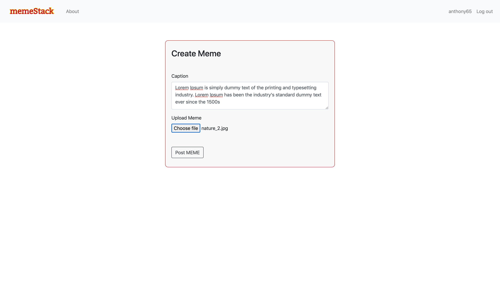
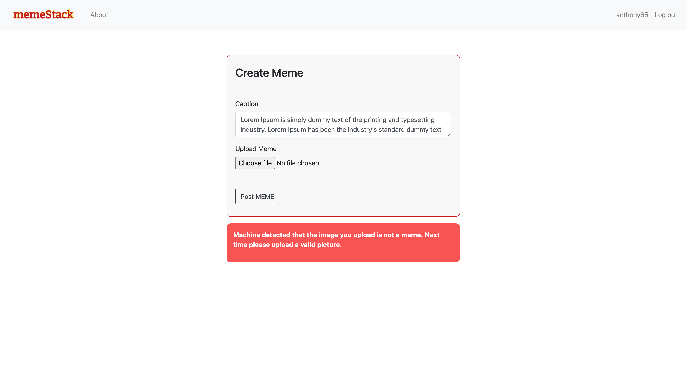

# memeStack

memeStack is social platform where people around the globe can join and share memes with family and friends. This project was devoloped as a side project where a pre-trained machine learning model were used which detects if user provided content is meme or not.
This pre-trained model were taken from [a github repository](https://github.com/pranaysawant/Memes-Classification-Model-End-to-End-Solution). The model used VGG19 architecture and Binary Cross Entropy were used as performance Metric. Details is provided in the link.

**[Click here to watch the video demo of the project](https://github.com/shafayet98/memeStack/blob/master/readme_stuff/memeStackDemo.mov)**

### Frontend Technology:
1. HTML5
2. CSS3
3. Bootstrap 4
4. JQuery

### Backend Technology:
1. Flask (Python Framework)
2. Pre-trained Machine Learning Model to detect Memes

### Project Contains:
* Login
* Registration
* User Profile
* Create and Mange Account(Update profile image, username, email etc..)
* Manage Uploaded Memes(Delete,provide captions etc..)
* Meme Detection
* User Restriction for several pages

**There are two folder**
* memeDetection: where I loaded the pre-trained model and tested
* memeStackSite: which holds the actual Flask App

### Some Part of Website

**This is the landing page of the site, from where user can create post and change account setting or view their profile and stuff. By clicking on each meme user can read the caption and visit the profile who posted the meme.**

**Glimpse of profile**

**When user create the post they are given a form where they can add caption and choose the meme(image). When the click on the post, the pre-trained model checks if the given image is a meme or not. if it's a meme user is redirected to the home page otherwise the image is not upload and a flash messange is shown.**

**as the image says the user upload an picture of nature so the machine detects it and gives an message to input a valid image(must be a meme)**

### Thanks for visiting the project and keep supporting my work. Thank you.
